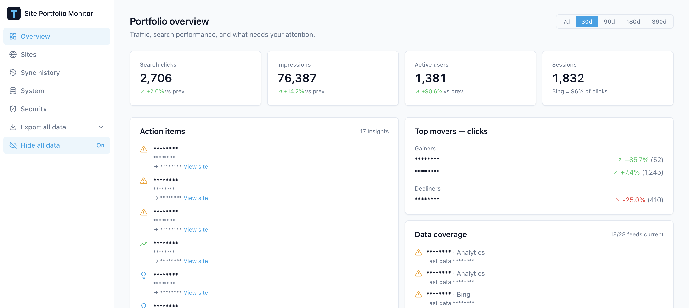
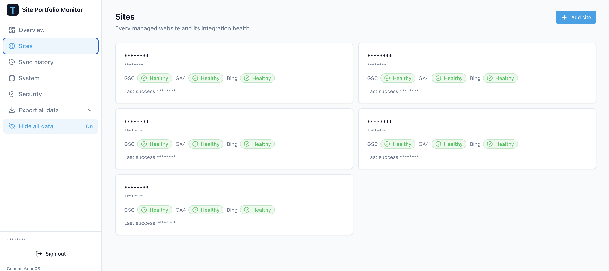
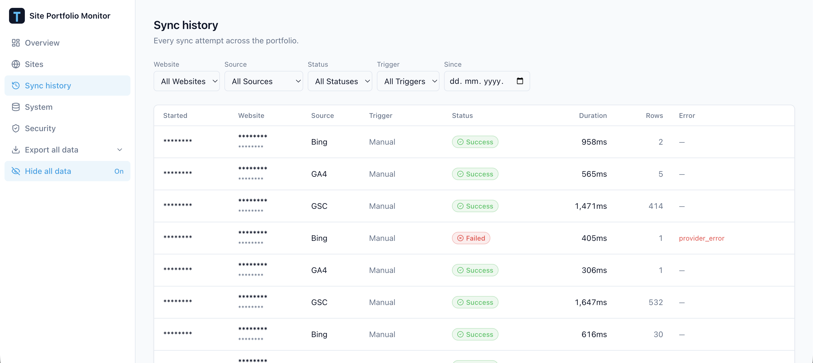
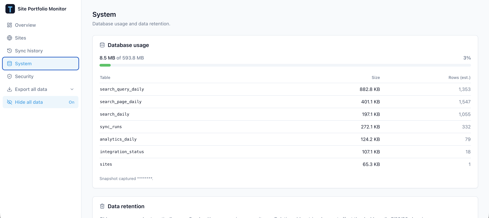
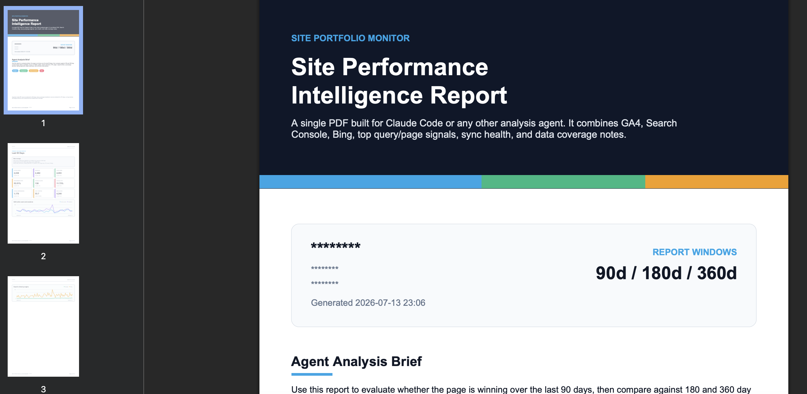
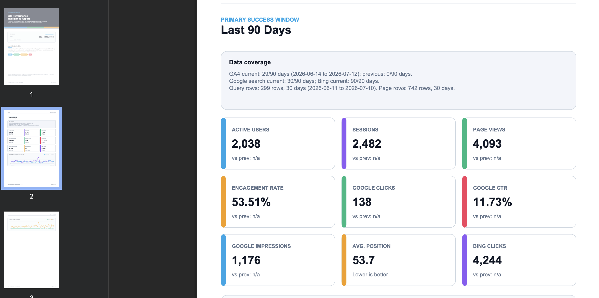
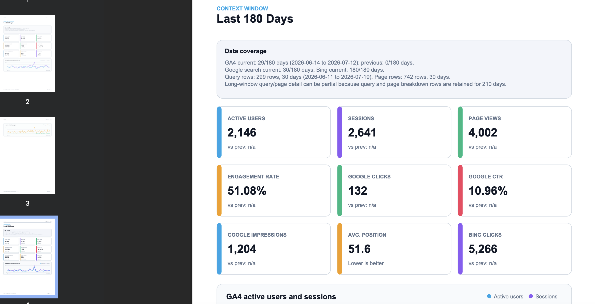
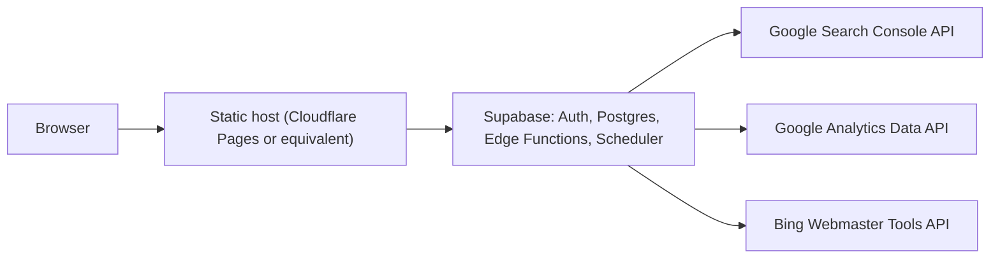

# Site Analytics

Self-hosted dashboard for monitoring Google Analytics 4, Google Search Console, and Bing Webmaster Tools across multiple websites.

It gives a solo publisher or small portfolio operator one private place to see traffic, search performance, data coverage, integration health, sync history, and the sites that need attention.

> **Single-admin by design.** This is a self-hosted control center, not a multi-tenant SaaS. It has no public signup, billing, organization workspaces, or role-management UI.

> **Recommended free stack:** deploy the frontend on [Cloudflare Pages](https://pages.cloudflare.com/) and use [Supabase's Free plan](https://supabase.com/pricing) for Auth, Postgres, Edge Functions, and scheduled jobs. This guide uses that combination from start to finish. You can deploy the static frontend to another host if you prefer.

## Live demo

[Open the hosted demo portal](https://admin-a0k.pages.dev/) and choose **View public demo**, or go directly to the [public demo dashboard](https://admin-a0k.pages.dev/demo). It uses only hardcoded synthetic data and never reads from a Supabase project.

## What it does

- Portfolio view with traffic and search KPIs, top movers, anomaly signals, and coverage gaps.
- Per-site GA4, Google Search Console, and Bing performance charts.
- Google Search Console top-query and top-page reporting.
- Daily scheduled syncs plus manual per-site syncs.
- Sync history, stale-data detection, sanitized errors, and data-retention controls.
- Email/password sign-in with mandatory TOTP MFA before dashboard data can be read.
- Supabase Row Level Security: browser reads require both an allowlisted admin and an MFA-verified (`aal2`) session.
- CSV/ZIP and PDF exports, plus a privacy mode for screensharing.

## Product tour

The screenshots below use the built-in privacy mode, which masks site names, domains, account details, and timestamps. The report examples show the generated PDF export.

### Portfolio overview and managed sites

<p align="center">
  
  
</p>

### Sync history and system health

<p align="center">
  
  
</p>

### PDF performance report

<p align="center">
  
  
</p>

<p align="center">
  
</p>

## Architecture



## Before you start: what you need

| Item | Why it is needed | Where it goes | Never commit it? |
| --- | --- | --- | --- |
| Supabase project URL and publishable key | Browser connects to your own Supabase project | `.env.local` and host environment variables | Publishable key is browser-safe; project URL is public |
| Supabase CLI (step 5 only) | The single step not done in a browser: deploying the Edge Functions | Your shell/CLI only | Yes |
| Google Cloud OAuth client ID and secret | Server-to-server access to GSC and GA4 | Supabase Edge Function secrets | Yes |
| Google OAuth refresh token | Lets scheduled jobs obtain short-lived Google access tokens | Supabase Edge Function secrets | Yes |
| Bing Webmaster API key | Fetches Bing traffic metrics | Supabase Edge Function secrets | Yes |
| Random automation secret | Authenticates Supabase scheduled calls to Edge Functions | Edge Function secrets **and** Supabase Vault | Yes |
| Public app URL | Auth redirects, CORS, and password-reset links | `VITE_APP_URL`, `ALLOWED_APP_ORIGIN`, Supabase Auth URLs | No credential, but use your real URL |

### Provider access required

1. **Google Search Console:** the Google account used for OAuth must have access to every Search Console property you add.
2. **Google Analytics 4:** that same Google account needs at least Viewer access to each GA4 property.
3. **Bing Webmaster Tools:** your API key must have access to every Bing site URL you add.

Google uses OAuth credentials here-not a Google API key. Enable the **Google Search Console API** and **Google Analytics Data API** in the same Google Cloud project before authorizing the app.

## Local quick start (synthetic data only)

This path does **not** touch a hosted Supabase project, your live sites, Google, or Bing.

### Prerequisites

- Node.js 20+ and npm
- Docker Desktop
- [Supabase CLI](https://supabase.com/docs/guides/local-development/cli/getting-started)

```bash
git clone https://github.com/jafforgehq/site-analytics-tool.git
cd site-analytics-tool
npm install
supabase start
supabase db reset
```

Copy the local API URL and **publishable** key from `supabase status`, then create `.env.local`:

```bash
cp .env.example .env.local
```

```dotenv
VITE_SUPABASE_URL=http://127.0.0.1:54321
VITE_SUPABASE_PUBLISHABLE_KEY=your-local-publishable-key
VITE_APP_URL=http://localhost:5173
```

Start the frontend:

```bash
npm run dev
```

The seed contains synthetic sites and metrics. To see them, create a user in local Supabase Studio, then run this in Studio's SQL editor with that user's UUID:

```sql
insert into private.admin_users (user_id)
values ('YOUR_AUTH_USER_UUID');
```

Sign in at `http://localhost:5173` and complete the TOTP setup. An `aal2` session is required before data becomes visible.

## Production setup

The following is a Cloudflare Pages + Supabase operator checklist. Replace every placeholder with your own values as you go. Nothing in this repository deploys automatically.

### Cost and accounts

For a small, personal portfolio this can run at $0 on the providers' Free plans:

- **Supabase Free:** includes a 500 MB database and two active projects. Free projects pause after one week of inactivity, so the first request after a long idle period can take a moment to wake it.
- **Cloudflare Pages Free:** serves this static frontend and provides 500 builds per month. Static asset requests are free and unlimited.

You need free accounts with **Supabase**, **Cloudflare**, **GitHub** (to connect this repository to Cloudflare Pages), Google Cloud, and Bing Webmaster Tools. Provider limits and pricing can change, so check their current plan pages before relying on this for a larger portfolio.

> **Set everything up from the web - no terminal.** Every step below is done in a browser: the Supabase Dashboard, the Google Cloud Console, the Google OAuth Playground, Bing Webmaster Tools, and your static host. There is exactly **one** exception - deploying the five Edge Functions (step 5) - because they share code under `_shared/` that no dashboard editor can bundle. That single step runs a few one-time commands; everything else is point-and-click.

> **Choose your Cloudflare Pages project name first.** Its default public URL will be `https://YOUR_PROJECT_NAME.pages.dev`. Use that exact URL wherever this guide shows `https://monitor.example.com`. You can use a custom domain later, but then update `ALLOWED_APP_ORIGIN`, Supabase Auth URLs, and `VITE_APP_URL` to the custom domain too.

### 1. Create the project and apply migrations

Create a new Supabase project in the dashboard. In **Project Settings → API**, note the project URL and publishable key.

Then apply the database migrations. They create the tables, RLS policies, Edge Functions' database permissions, scheduled cron jobs, and retention jobs.

Open the **SQL Editor**, then open each file in [`supabase/migrations/`](supabase/migrations) on GitHub in filename order (`0001` → `0008`), paste its contents into a new query, and run it - one file at a time, in order.

Afterwards, open **Integrations → Cron → Jobs**: four jobs (three daily syncs plus a weekly cleanup) should be listed. Scheduled syncs will report configuration errors until the secrets in the next steps exist; they do not affect an unrelated project.

### 2. Configure Google Cloud and mint a refresh token

This produces three of your Edge Function secrets: `GOOGLE_CLIENT_ID`, `GOOGLE_CLIENT_SECRET` (from the OAuth client in the [Google Cloud Console](https://console.cloud.google.com)), and `GOOGLE_REFRESH_TOKEN` (from Google's web-based OAuth Playground). It's entirely browser-based - no terminal.

1. **Create or select a project.** One project holds both APIs and the OAuth client.
2. **Enable the two APIs.** In **APIs & Services → Library**, enable **Google Search Console API** and **Google Analytics Data API**. You can confirm both afterwards under **APIs & Services → Enabled APIs & services**, which also shows each API's request, error, and latency metrics.
3. **Configure the OAuth consent screen** (**APIs & Services → OAuth consent screen**, surfaced under "Google Auth Platform" in the newer console). The app requests only two **read-only** scopes - `.../auth/webmasters.readonly` (Search Console) and `.../auth/analytics.readonly` (GA4). While the app is in **Testing**, add the Google account that owns the sites as a **test user**, or authorization is blocked.
4. **Create the OAuth client.** In **APIs & Services → Credentials → Create credentials → OAuth client ID**, pick application type **Web application** and name it anything (e.g. `Site Analytics`). Copy its **Client ID** and **Client secret** - these are `GOOGLE_CLIENT_ID` and `GOOGLE_CLIENT_SECRET`.
5. **Add the Playground redirect URI.** On the OAuth client you just created, add `https://developers.google.com/oauthplayground` to its **Authorized redirect URIs** (Google requires an exact match) and save.

Now mint the refresh token in the browser with the [Google OAuth 2.0 Playground](https://developers.google.com/oauthplayground):

1. Click the **gear icon** (⚙, top-right) → tick **Use your own OAuth credentials**, and paste your **Client ID** and **Client secret**. Make sure **Access type** is **Offline** so Google returns a refresh token.
2. In the left **Step 1** panel, skip the API list and paste both scopes into **"Input your own scopes,"** separated by a space:
   - `https://www.googleapis.com/auth/webmasters.readonly`
   - `https://www.googleapis.com/auth/analytics.readonly`
3. Click **Authorize APIs** and sign in with the Google account that can read all intended Search Console and GA4 properties. Approve access (accept the "unverified app" notice if your consent screen is still in Testing).
4. Back in the Playground, under **Step 2**, click **Exchange authorization code for tokens** and copy the **Refresh token** - that value is `GOOGLE_REFRESH_TOKEN`.

Store the refresh token immediately in a password manager or directly as the Supabase Edge Function secret; never paste it into source code, an issue, or a commit. (If no refresh token comes back, remove the app under your Google Account's **Third-party access**, then redo step 3 so Google issues a fresh one.)

### 3. Create a Bing API key

In Bing Webmaster Tools, create an API key from an account that can access each site you plan to add. Copy it into the `BING_WEBMASTER_API_KEY` Edge Function secret in step 4.

### 4. Set Edge Function secrets and Vault values

Generate a long random value for `AUTOMATION_SECRET`. You will reuse the **exact same value** for the `automation_secret` Vault entry below - the scheduled jobs authenticate with it, so a mismatch makes every scheduled sync fail with a 401.

**Edge Function secrets** (the server credentials) - go to **Edge Functions → Secrets**. The "Add or replace secrets" box accepts pasted key–value pairs, so you can add all six at once:

```
GOOGLE_CLIENT_ID=YOUR_GOOGLE_CLIENT_ID
GOOGLE_CLIENT_SECRET=YOUR_GOOGLE_CLIENT_SECRET
GOOGLE_REFRESH_TOKEN=YOUR_GOOGLE_REFRESH_TOKEN
BING_WEBMASTER_API_KEY=YOUR_BING_WEBMASTER_API_KEY
AUTOMATION_SECRET=YOUR_LONG_RANDOM_VALUE
ALLOWED_APP_ORIGIN=https://monitor.example.com
```

**Vault values** (what the scheduled cron jobs read at run time) - go to **Integrations → Vault → Secrets** and choose **Add new secret** twice:

- Name `project_url`, value `https://YOUR_PROJECT_REF.supabase.co`
- Name `automation_secret`, value the same random string you used for `AUTOMATION_SECRET` above

### 5. Deploy the Edge Functions - the one terminal step

This is the **only** part that isn't point-and-click. The five functions - `manage-sites`, `manual-sync`, `scheduled-sync-gsc`, `scheduled-sync-ga4`, `scheduled-sync-bing` - share helpers in [`supabase/functions/_shared/`](supabase/functions/_shared) (imported as `../_shared/...`), and the dashboard's in-browser editor deploys one function in isolation, so it can't resolve those shared imports. The [Supabase CLI](https://supabase.com/docs/guides/local-development/cli/getting-started) bundles the shared code automatically, so run this once from a clone of the repo:

```bash
supabase login
supabase link --project-ref YOUR_PROJECT_REF
supabase functions deploy manage-sites
supabase functions deploy manual-sync
supabase functions deploy scheduled-sync-gsc
supabase functions deploy scheduled-sync-ga4
supabase functions deploy scheduled-sync-bing
```

Then confirm all five appear under **Edge Functions** in the dashboard. After this one step, everything else is back in the browser.

### 6. Lock down Supabase Auth and create your admin

In **Authentication → Sign In / Providers**, keep email enabled and disable public sign-up. In **Authentication → URL Configuration**, set:

- Site URL: `https://monitor.example.com`
- Redirect URLs: `https://monitor.example.com/reset-password` and your local development URL if needed.

Create your first user in the Supabase Dashboard (Authentication → Users). Copy the UUID and add it to the private allowlist:

```sql
insert into private.admin_users (user_id)
values ('YOUR_AUTH_USER_UUID');
```

Once the app is deployed (step 7), that user signs in and enrolls TOTP in the app. A password alone is intentionally insufficient.

### 7. Deploy the static frontend

This project is a static Vite frontend. The recommended $0 deployment path is **Cloudflare Pages**:

1. Push your own copy (fork or cloned repository) to GitHub. Do not add `.env.local` or any provider secret to Git.
2. In Cloudflare, open **Workers & Pages** → **Create application** → **Pages** → **Connect to Git**. Authorize GitHub, select your repository, and choose the project name you picked above.
3. In the build configuration, leave the root directory blank, select the `main` branch, and enter the build settings below.
4. Before the first production deployment, open **Settings** → **Variables and secrets**. Add the three required `VITE_*` variables for the **Production** environment. Use the Plaintext type: these are public browser configuration values, not server secrets.
5. Click **Save and Deploy**. Cloudflare builds the site and gives you `https://YOUR_PROJECT_NAME.pages.dev`.
6. Visit that URL, sign in with the admin account from step 6, and complete the TOTP enrollment. Run one manual sync and check **Sync history** before trusting scheduled data.

Use these Cloudflare build settings:

| Setting | Value |
| --- | --- |
| Build command | `npm run build` |
| Output directory | `dist` |
| Node version | 20 or newer |
| `VITE_SUPABASE_URL` | Your project URL |
| `VITE_SUPABASE_PUBLISHABLE_KEY` | Your project's publishable key |
| `VITE_APP_URL` | Your exact public application URL |
| `VITE_DB_SIZE_LIMIT_MB` | Optional: plan database limit in MB |

`VITE_SUPABASE_URL`, `VITE_SUPABASE_PUBLISHABLE_KEY`, and `VITE_APP_URL` are required. `VITE_DB_SIZE_LIMIT_MB` is optional; on Supabase Free the default of 500 is already correct, so you can leave it out. Use the exact names - the app reads them at build time (via [`src/lib/env.ts`](src/lib/env.ts)) and will not start if they differ. The `VITE_` prefix is required for Vite to expose these values to the browser.

If you prefer Vercel, Netlify, GitHub Pages, or another static host, use the same build command, `dist` output directory, and `VITE_*` values. Configure SPA fallback to `index.html`; this repository includes [`public/_redirects`](public/_redirects) for hosts that support that convention. In all cases, the host URL must match `ALLOWED_APP_ORIGIN`, Supabase Auth's Site URL and Redirect URLs, and `VITE_APP_URL`.

If you use a custom domain on Cloudflare, add it under the Pages project's **Custom domains** settings. Then replace the default `pages.dev` URL in `ALLOWED_APP_ORIGIN`, Supabase Auth, and `VITE_APP_URL`. Change only the DNS record for that subdomain - do not change unrelated root-domain records.

### 8. Add your sites

From the **Sites** page, add each website and enter only the identifiers you use:

- **GSC property:** `sc-domain:example.com` for a Domain property, or the full URL for a URL-prefix property.
- **GA4 property ID:** numeric property ID, not the `G-XXXX` measurement ID.
- **Bing site URL:** the exact verified Bing site URL.

Configured integrations enable automatically. Use a manual sync for the first import, then inspect **Sync history** and **Integration health** before trusting scheduled data.

## Two-factor authentication

TOTP two-factor auth is **mandatory**: browser reads require an MFA-verified (`aal2`) session, enforced in the database by Row Level Security. A valid password alone yields an empty dashboard. It is fully Supabase-native - Supabase generates the secret and QR code server-side, and no external 2FA service (SMS gateway, Authy, etc.) is involved. Any standard TOTP app works (Google Authenticator, Authy, 1Password, and so on).

**First-time setup.** After you add yourself to the admin allowlist (step 6), sign in with your password and the app immediately walks you through enrolling an authenticator: scan the QR code, enter the 6-digit code, and your session becomes `aal2`.

**Adding, replacing, or recovering a device.** By design, the in-app "add / remove authenticator" buttons do **not** work - a hardening trigger ([`0003_mfa_enrollment_guard.sql`](supabase/migrations/0003_mfa_enrollment_guard.sql)) blocks any MFA-factor change made from an app session, so that someone holding only your password cannot enroll their own factor and walk in. To move to a new phone, put your code on a second device, or recover a lost one, reset your factor from the Supabase **SQL editor** (the `postgres` role is exempt from the trigger) and then re-enroll:

```sql
-- Removes your current authenticator. Replace the email with your admin account.
delete from auth.mfa_factors
where user_id = (select id from auth.users
                 where email = 'you@example.com');
```

Then sign out, sign back in, and the app shows a fresh QR. Because TOTP secrets are not device-bound, scan that one QR on **every** device you want codes on **before** you verify - you cannot add more afterwards without repeating this reset. Note that you have no second factor between the delete and the re-enroll, so do it only when you can finish immediately; your password still gates sign-in during that short window.

## Safety model

- No server credential is bundled into the frontend.
- Browser-readable data requires an allowlisted admin and MFA at assurance level `aal2`.
- All provider writes use Supabase Edge Functions with server-side credentials.
- Errors are sanitized before storage and display.
- Local seed data is synthetic. `supabase db reset` resets only the local Docker database unless you deliberately target a hosted project with other CLI commands.

## Commands

| Command | Purpose |
| --- | --- |
| `npm run dev` | Start frontend development server |
| `npm run build` | Type-check and create production build |
| `npm run lint` | Run ESLint |
| `npm run typecheck` | TypeScript check, no emit |
| `npm test` | Run unit tests |
| `npm run format:check` | Verify formatting |
| `npm run oauth:google` | Optional local alternative to the OAuth Playground for minting a Google refresh token |

## Known limitations

- One administrator and one portfolio per deployment.
- No public signup, team roles, billing, alerts, or multi-organization isolation.
- Uses daily aggregate data; it is not a full keyword-rank tracker or website crawler.
- Google and Bing provider quotas, permissions, and API changes are controlled by those providers.
- Authenticator (2FA) devices are managed from the SQL editor, not the app UI - see [Two-factor authentication](#two-factor-authentication).

## Contributing

See [CONTRIBUTING.md](CONTRIBUTING.md).

## License

[MIT](LICENSE)
